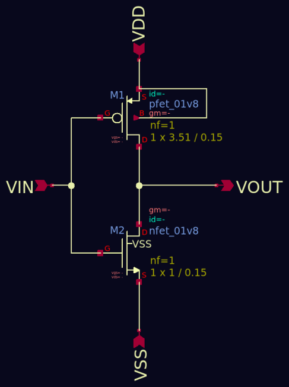
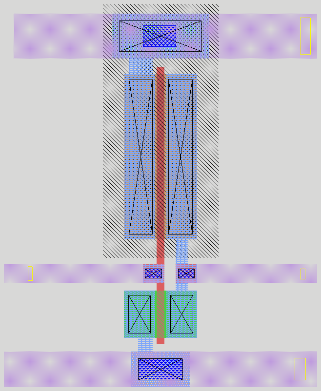
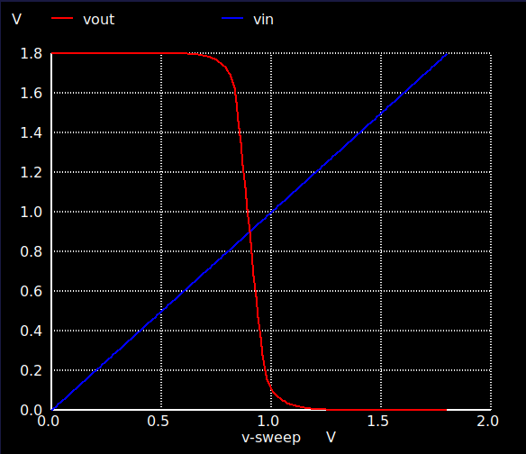
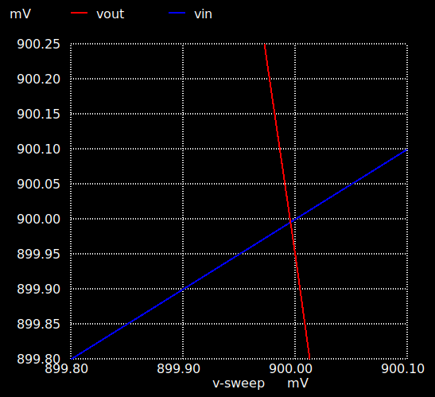
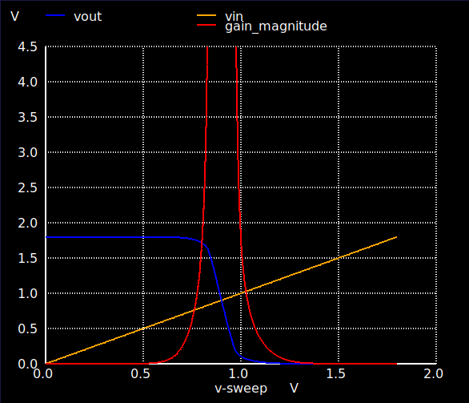

# Full-Custom SKY130 CMOS Inverter

CMOS inverter design from schematic to full-custom layout, LVS clean,
parasitic extraction and post-layout PVT characterisation.

**LVS: `Netlists match uniquely`**; 2 devices, 4 nets, pin lists equivalent
([full report](verification/lvs_report.txt)).

| Schematic | Layout |
|:---:|:---:|
|  |  |
| PMOS `W/L = 3.51/0.15 µm`, NMOS `W/L = 1/0.15 µm` | Full-custom magic layout design |


## Summary

| Parameter | Value |
|---|---|
| Process | L<sub>N/P</sub> = 0.15 µm |
| Supply | V<sub>DD</sub> = 1.8 V |
| Sizing | W<sub>N</sub> = 1 µm, W<sub>P</sub> = 3.51 µm (3.51 : 1) |
| Switching threshold | V<sub>M</sub> = 0.900 V (V<sub>DD</sub>/2 @ TT) |
| Worst-case noise margin | 0.608 V (FS corner, NM<sub>H</sub>) ≈ 33.8 % of V<sub>DD</sub> |
| Load / frequency | 20 fF / 100 MHz (20 ps input edges) |

PMOS width was swept to centre V<sub>M</sub> at V<sub>DD</sub>/2, compensating for
lower hole mobility. The zoomed image below shows the crossing at approx. 900.00 mV.

| DC Transfer Characteristic | V<sub>M</sub> Centring (zoomed) | Small-signal Gain |
|:---:|:---:|:---:|
|  |  |  |
| V<sub>OUT</sub> vs V<sub>IN</sub> sweep, 0 → 1.8 V | crossing at approx. 900.00 mV | unity-gain points set noise margins |

## Key Results Pre vs Post-layout

Nominal corner (TT / 1.8 V / 27 °C) using 20 fF C<sub>load</sub>:

| Parameter | Pre-layout | Post-layout (PEX) | Δ |
|---|---|---|---|
| t<sub>PHL</sub> | 53.72 ps | 59.02 ps | +9.9 % |
| t<sub>PLH</sub> | 40.14 ps | 43.94 ps | +9.5 % |
| t<sub>output_rise</sub> (10–90 %) | 69.73 ps | 77.30 ps | +10.9 % |
| t<sub>output_fall</sub> (90–10 %) | 77.11 ps | 85.58 ps | +11.0 % |
| Avg. supply power | 7.87 µW | 8.73 µW | +10.9 % |
| Peak supply power | 1.65 mW | 1.65 mW | ≈ 0 % |

TT Static power: 
  878 pW for V<sub>IN</sub> HIGH and 3.67 pW for V<sub>IN</sub> LOW. 
  Static power peaked at 67.8 µW (V<sub>IN</sub> = 0.96 V) because of high short circuit current.

### PVT Extremes

Post-layout.
Using 5 process corners, V<sub>DD</sub> ±10 %, and −40 °C to 125 °C:

| Parameter | SS / 1.62 V / 125 °C | TT / 1.80 V / 27 °C | FF / 1.98 V / −40 °C | Spread mag. |
|---|---|---|---|---|
| t<sub>PHL</sub> | 95.56 ps | 59.02 ps | 42.59 ps | 2.24× |
| t<sub>PLH</sub> | 64.81 ps | 43.94 ps | 30.54 ps | 2.12× |
| t<sub>output_rise</sub> | 115.93 ps | 77.30 ps | 52.91 ps | 2.19× |
| t<sub>output_fall</sub> | 144.81 ps | 85.58 ps | 61.01 ps | 2.37× |
| Avg. power | 7.29 µW | 8.73 µW | 10.27 µW | 1.41× |

## Findings

**Centring V<subM</sub> did not guarantee equal transition times**. 

Centring V<subM</sub> matches the transistors at one operating point and not the full range. V<sub>M</sub> at V<sub>DD</sub>/2: t<sub>PHL</sub> exceeded t<sub>PLH</sub> by 34% and fall times were greater than rise times across the full load sweep.
When the output swings, the PMOS and NMOS move through saturation and triode regions at different rates. PMOS delivers more current over most of the range, which explains why the output fell more slowly (77.11 ps) than it rose (69.73 ps) despite V<subM</sub> sitting at V<sub>DD</sub>/2.

**Parasitics consistently cost approximately 10 % post-layout**. 

Extraction added ~10 % to every delay, edge rate and the average power. Peak power remained essentially unchanged; extracted capacitance slows edges without moving peak short circuit current.

**Timing spreads over PVT >2x faster than power**. 

Delay varied around 2.2–2.4X across the corner box and average power varied less at 1.4X. This showed timing closure, and not so much the power budget, is what constrains the cell.


## Workflow

1. Schematic capture and simulation — Xschem & ngspice → [`schematic/`](schematic/), [`simulation/pre-layout/`](simulation/pre-layout/)
2. Layout design — Magic → [`layout/`](layout/)
3. LVS clean — Netgen → [`verification/`](verification/)
4. Parasitic extraction and post-layout simulation → [`simulation/post-layout/`](simulation/post-layout/)
5. PVT corner sweep → [`simulation/pvt/`](simulation/pvt/)

## Repository Structure

```
schematic/              inverter.sch/.sym + xschemrc
layout/                 inverter_layout.mag  (.ext regenerated, not included)
simulation/
  pre-layout/           DC and transient testbenches
  post-layout/          PEX netlist + timing, dynamic and static power decks
  pvt/
    pre-layout/         corner deck templates
    post-layout/        corner deck templates
    runs/               28 decks generated from templates; one per corner
    results/            tabulated timing and power; pre vs post
verification/           LVS netlists, netgen script, report
images/                 figures used in this README
```

## Tools 
ngspice - Xschem - Magic VLSI - netgen - SKY130 PDK - Linux/WSL
